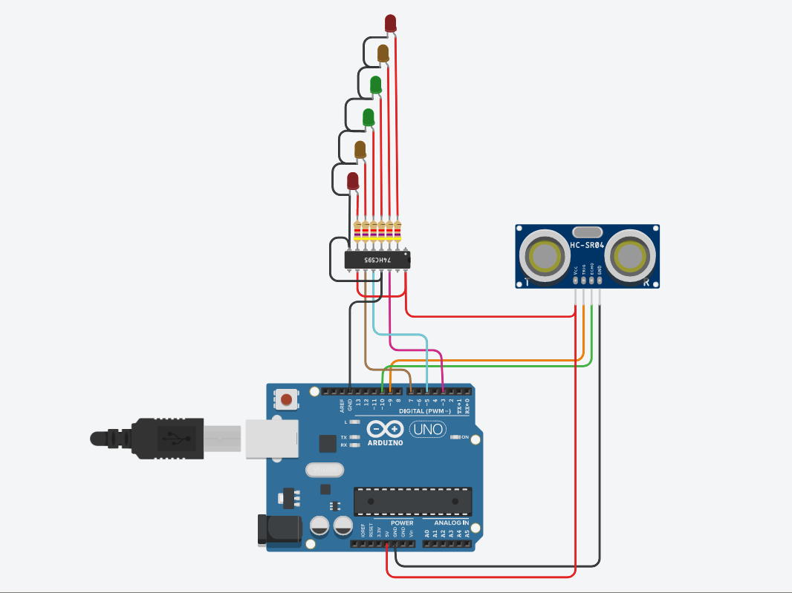
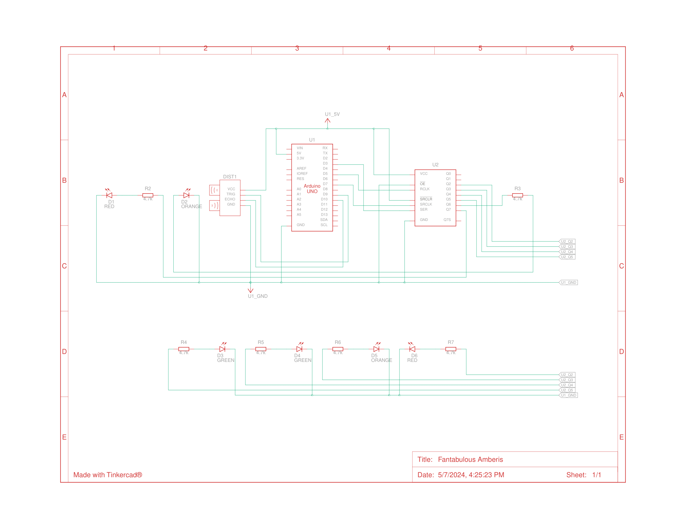
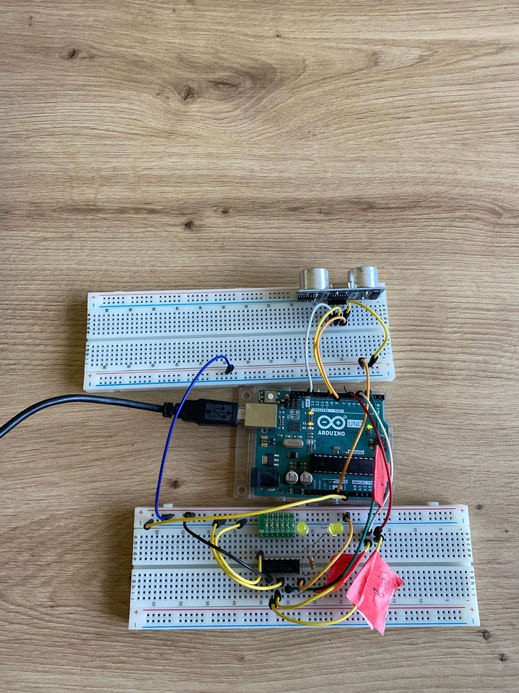
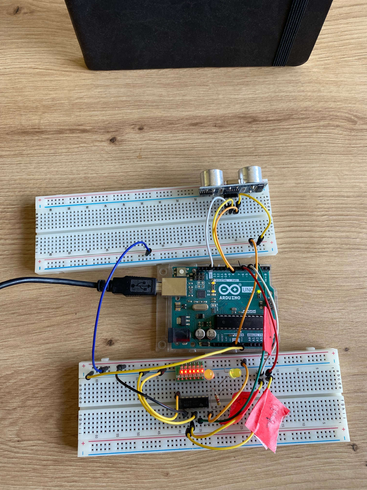

# Parktronic

Parktronic is an Arduino-based device designed to assist drivers in parking by detecting the distance between their vehicle and obstacles behind them. This repository contains the code for the Parktronic device along with relevant project files.

## Features

- Utilizes ultrasonic sensors to measure distance.
- LED lights to indicate the proximity of obstacles.
- Easily configurable thresholds for different alert levels.

## Components Used

- Arduino board
- 74HC595N shift register
- HC-SR04 ultrasonic detector
- Wires
- X6 LED lights board with resistors/ x6 different colours LED with 4.7kOhms resistors

## Circuit Diagram

## Demo
Withouth Obstacle

With Obstacle

## How does it works?

The Parktronic device employs an ultrasonic sensor to detect obstacles. As an obstacle approaches within 30 centimeters, two LED lamps will start lighting up. As the obstacle moves closer to the sensor, additional LED lamps will progressively illuminate, indicating the decreasing distance between the vehicle and the obstacle.

## Installation and Usage

1. Clone this repository to your local machine.
2. Upload the Arduino sketch to your Arduino board.
3. Connect the ultrasonic sensors according to the circuit diagram.
4. Power up the Arduino board and the device is ready to use.

## Usage Example

Once the device is powered up and properly configured, it will start measuring the distance between the vehicle and obstacles. The LED display will indicate the proximity level based on the distance measured.

## Contributing

Contributions are welcome! For major changes, please open an issue first to discuss what you would like to change.

